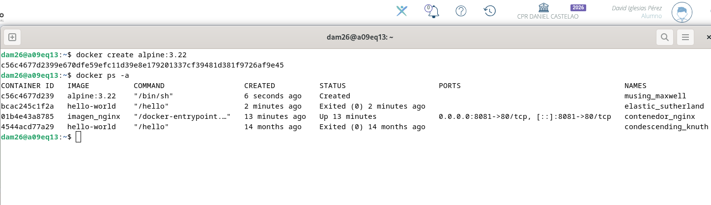
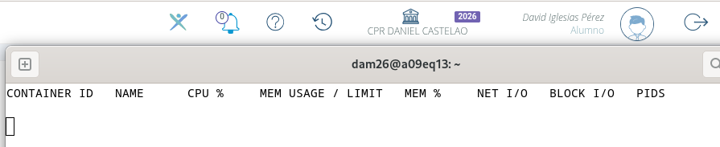

# Práctica Docker

## 1. Descargar la imagen de Alpine

Descargamos la imagen de Alpine utilizando una versión concreta, en este caso la versión `3.22`, sin utilizar `latest`.

```bash
docker pull alpine:3.22
```

Después comprobamos que la imagen se ha descargado correctamente con:

```bash
docker images
```

En la captura se puede comprobar que aparece la imagen `alpine` con la etiqueta `3.22`.


---

## 2. Crear un contenedor sin nombre y sin arrancarlo

Para crear un contenedor sin arrancarlo utilizamos:

```bash
docker create alpine:3.22
```

Después comprobamos su estado con:

```bash
docker ps -a
```



---

## 3. Crear y arrancar `dam_alp1` con una shell

Para crear y arrancar el contenedor `dam_alp1` con una shell utilizamos:

```bash
docker run -it --name dam_alp1 alpine:3.22 /bin/sh
```

Las opciones `-i` y `-t` son necesarias para poder trabajar de forma interactiva dentro del contenedor.

* `-i` permite mantener la entrada estándar conectada.
* `-t` crea una terminal para poder escribir y trabajar desde ella.


---

## 4. Consultar la IP y comprobar la conexión a Internet

Desde dentro de `dam_alp1` utilizamos:

```bash
ip a
```

Con este comando podemos ver las interfaces de red del contenedor y su dirección IP.

Después comprobamos si el contenedor tenía conexión con Internet haciendo ping a Google:

```bash
ping -c 3 google.com
```

El ping funcionó correctamente, por lo que el contenedor tiene conexión de red hacia Internet.


---

## 5. Comunicación entre `dam_alp1` y `dam_alp2`

Dejamos `dam_alp1` funcionando sin pararlo utilizando la combinación:

```text
Ctrl + P
Ctrl + Q
```

Después creamos y arrancamos `dam_alp2` de la misma forma:

```bash
docker run -it --name dam_alp2 alpine:3.22 /bin/sh
```

Con los dos contenedores funcionando comprobamos la comunicación entre ellos:

* **Por IP:** funcionó correctamente porque los contenedores pueden comunicarse mediante sus direcciones IP.
* **Por nombre:** no funcionó (`bad address`) porque la red `bridge` por defecto no permite resolver los nombres de los contenedores.


---

## 6. Consumo de memoria

Con los dos contenedores en marcha utilizamos:

```bash
docker stats
```

Este comando muestra el consumo de recursos de los contenedores, incluida la memoria.


---

## 7. Salida de los contenedores

Salimos de los contenedores utilizando:

```bash
exit
```

Al repetir:

```bash
docker stats
```

ya no aparecen, porque `docker stats` solo muestra los contenedores que están en ejecución.



---

## 8. Espacio ocupado en disco

Para comprobar el espacio ocupado por Docker utilizamos:

```bash
docker system df
```

Este comando muestra el espacio utilizado por las imágenes y los contenedores.


